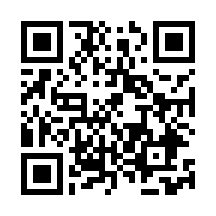

# TideGraph

釣りで潮を見るための、スマホ向けタイドグラフです。

2026年版の潮位データを内蔵しているので、地点と日付を選ぶだけで、満潮・干潮、潮回り、24時間の潮位グラフ、釣りのチャンス時間帯を確認できます。

## 使い方

1. 地点を選びます。
2. 日付を選びます。
3. グラフと満潮・干潮の時刻を確認します。

現在は2026年版です。2027年以降のデータが必要になった場合は、リポジトリのIssueで知らせてください。

## スマホで開く

スマホでは、以下のURLを開くか、QRコードを読み取ってください。

[https://temochiz-lab.github.io/tidegraph/](https://temochiz-lab.github.io/tidegraph/)

## iPhoneでホーム画面に追加する方法

1. iPhoneのSafariでTideGraphを開きます。
2. 画面下の共有ボタンを押します。
3. 「ホーム画面に追加」を選びます。
4. 名前を確認して「追加」を押します。
5. ホーム画面に追加されたアイコンから起動します。

※ iPhoneでは、Safariから追加するのが一番安定します。

## Androidでホーム画面に追加する方法

1. AndroidのChromeでTideGraphを開きます。
2. 右上のメニュー、または画面に出る案内から「ホーム画面に追加」を選びます。
3. 名前を確認して「追加」を押します。
4. ホーム画面に追加されたアイコンから起動します。

端末やChromeのバージョンによっては、「アプリをインストール」や「ホーム画面に追加」と表示されます。

## 収録地点

気象庁の潮位表掲載地点一覧をもとに、2026年版は全国239地点を地域ごとに収録しています。

- 北海道
- 東北
- 関東
- 中部
- 北陸・日本海
- 西日本
- 九州
- 沖縄・奄美
- 有明・長崎

地点はアプリ内の選択ボックスから選べます。

## データ更新のお願い

このアプリは、年ごとの潮位データをあらかじめリポジトリに入れて使います。

もし私が翌年版への更新を忘れていたら、以下からIssueを立てて教えてください。

[更新依頼のIssueを作る](https://github.com/temochiz-lab/tidegraph/issues/new)

## 注意

このアプリの表示は予測潮位です。天候、気圧、風、波などによる実際の海面変動は反映されません。

安全航行用の装置としては使わず、釣行や移動の判断は現地の状況と公的な情報もあわせて確認してください。

## データ出典

気象庁の潮位表データをもとに、本アプリで表示用に加工しています。

## ライセンス

このリポジトリはMIT Licenseです。詳しくは [LICENSE](LICENSE) を確認してください。
